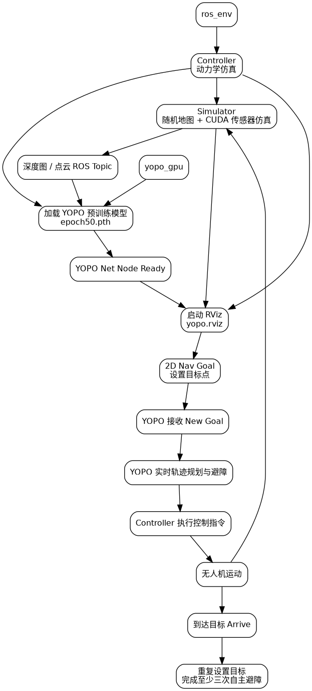

# 第二阶段：YOPO 环境搭建与系统运行

- 姓名：李紫锐
- 提交日期：2026-08-29
- 阶段目标：完成 YOPO 环境配置，编译 Controller 与 Simulator，并成功运行预训练模型和三次自主避障仿真。

## 1. 完成情况

本阶段已完成：

- 获取并熟悉 YOPO 项目代码
- 创建 Python 3.8 Conda 环境
- 安装 requirements.txt 依赖
- 配置 ROS Noetic
- 配置 CUDA 环境
- 完成 Controller 编译
- 完成 Simulator 编译
- 启动无人机动力学仿真
- 启动随机环境与 CUDA 传感器仿真
- 加载 YOPO 预训练模型 epoch50.pth
- 启动 RViz
- 使用 2D Nav Goal 设置目标点
- 连续完成至少三次自主避障运行

## 2. 实验环境

### 系统与硬件

- Ubuntu 24.04.4 LTS
- NVIDIA GeForce RTX 5060 Laptop GPU
- NVIDIA Driver 595.84
- nvidia-smi 显示 CUDA compatibility 13.2
- CUDA Toolkit 13.0，nvcc V13.0.88
- GPU Compute Capability：sm_120

### ROS

- ROS 1 Noetic
- ROS version：1.17.4
- 通过 RoboStack / Conda 环境 ros_env 配置

### Conda 环境

本阶段保留三套环境：

1. yopo
   - Python 3.8
   - 用于完成任务要求中的 Python 3.8 环境和原始 requirements.txt 依赖安装

2. ros_env
   - 用于 ROS Noetic、Controller、Simulator 和 RViz

3. yopo_gpu
   - Python 3.9
   - PyTorch 2.7.1+cu128
   - 用于 RTX 5060 Laptop GPU 上实际运行 YOPO

环境导出文件位于：

- environment/yopo_python38.yml
- environment/ros_env.yml
- environment/yopo_gpu.yml

## 3. CUDA / PyTorch 兼容性说明

YOPO 原始 requirements.txt 固定使用 PyTorch 2.4.1+cu118。

RTX 5060 Laptop GPU 属于较新的 Blackwell GPU，计算能力为 sm_120。原始 PyTorch 2.4.1+cu118 可以检测到 CUDA，但其预编译内核不支持 sm_120。

因此保留原始 Python 3.8 的 yopo 环境作为任务要求和依赖安装记录，同时额外创建 yopo_gpu 运行环境，使用：

- Python 3.9
- PyTorch 2.7.1+cu128
- torchvision 0.22.1+cu128
- torchaudio 2.7.1+cu128

最终 GPU Tensor 运算测试成功。

## 4. Controller 编译

进入 ROS 环境：

    conda activate ros_env
    cd ~/YOPO/Controller

由于项目代码较旧，而当前 Boost、CMake、编译器环境较新，进行了兼容性调整，包括：

- GCC/G++ 11
- C++ 标准由 C++11 调整为 C++14
- CMake 增加 CMAKE_POLICY_VERSION_MINIMUM=3.5
- 修复旧版 bundled Odeint 与新版 Boost.Math 的兼容问题
- EmPy 从 4.x 调整为 ROS Noetic 代码兼容的 3.3.4

最终编译命令：

    CC=gcc-11 CXX=g++-11 catkin_make -j1 -DCMAKE_POLICY_VERSION_MINIMUM=3.5

最终成功生成 quadrotor_simulator_so3 等可执行文件。

## 5. Simulator 编译

进入环境并配置 CUDA：

    conda activate ros_env
    cd ~/YOPO/Simulator
    export PATH=/usr/local/cuda-13.0/bin:$PATH
    export LD_LIBRARY_PATH=/usr/local/cuda-13.0/lib64:${LD_LIBRARY_PATH:-}
    export LIBRARY_PATH="$CONDA_PREFIX/lib:${LIBRARY_PATH:-}"

补充 PCL / pcl_ros / yaml-cpp 等依赖后执行：

    CC=gcc-11 CXX=g++-11 catkin_make -j1 -DCMAKE_POLICY_VERSION_MINIMUM=3.5

最终成功生成：

- sensor_simulator
- sensor_simulator_cuda
- dataset_generator
- libraycast_cuda.so

## 6. 完整启动命令

系统运行时使用四个终端。

### 终端 1：Controller 与动力学仿真

    conda activate ros_env
    cd ~/YOPO/Controller
    source devel/setup.bash
    roslaunch so3_quadrotor_simulator simulator_attitude_control.launch

成功后可看到 TakeOff Done / Ready to Flight。

### 终端 2：环境与 CUDA 传感器仿真

    conda activate ros_env
    cd ~/YOPO/Simulator
    source devel/setup.bash
    export PATH=/usr/local/cuda-13.0/bin:$PATH
    export LD_LIBRARY_PATH=/usr/local/cuda-13.0/lib64:${LD_LIBRARY_PATH:-}
    export LIBRARY_PATH="$CONDA_PREFIX/lib:${LIBRARY_PATH:-}"
    rosrun sensor_simulator sensor_simulator_cuda

成功后可看到：

- Generate Random Map
- Mapping
- Simulation Ready

### 终端 3：YOPO

    conda activate yopo_gpu
    cd ~/YOPO/YOPO
    python test_yopo_ros.py --trial=1 --epoch=50

成功加载：

    saved/YOPO_1/epoch50.pth

并出现：

    YOPO Net Node Ready!

### 终端 4：RViz

    conda activate ros_env
    cd ~/YOPO/YOPO
    rviz -d yopo.rviz

在 RViz 中使用 2D Nav Goal 设置目标点。

## 7. 典型问题与解决方法

### 问题 1：Controller 的 EmPy API 不兼容

现象：

    AttributeError: module 'em' has no attribute 'RAW_OPT'

原因：
ROS Noetic 的消息生成代码依赖旧版 EmPy API，而当前环境安装的是 EmPy 4.x。

解决：

    python -m pip install "empy==3.3.4" --force-reinstall

结果：
ROS message generation 恢复正常，Controller 最终编译成功。

对应截图：

- errors/phase2_controller_empy_error.png

### 问题 2：Simulator 找不到 PCL / pcl_ros

现象：

    Could not find a package configuration file provided by "PCL"

以及：

    fatal error: pcl_ros/point_cloud.h: No such file or directory

解决：
在 ros_env 中安装 PCL 与 ROS Noetic pcl_ros 相关依赖。

结果：
PCLConfig.cmake 与 pcl_ros/point_cloud.h 均能够正常找到。

对应截图：

- errors/phase2_simulator_pcl_error.png

### 问题 3：SciPy Rotation 与 Torch Tensor 类型兼容问题

运行 YOPO 时，SciPy Rotation 接收到 Torch Tensor 后出现数据类型错误。

处理方法：
在传入 scipy.spatial.transform.Rotation.from_euler 前显式转换 alpha / beta 为 Python float。

结果：
YOPO 成功继续初始化。

对应截图：

- errors/phase2_yopo_scipy_torch_error.png

### 问题 4：OpenCV / NumPy 混装导致 ndarray 类型异常

现象包括：

    src is not a numpy array
    Unable to configure default ndarray.__repr__

检查后发现环境中存在 NumPy 1.x 与此前 NumPy 2.x 残留文件混合的问题。

处理方法：

- 清理旧 NumPy 残留
- 重新安装 NumPy 1.26.4
- 使用 Conda OpenCV 4.9.0
- 重新验证 NumPy、OpenCV 和 PyTorch 数据转换

最终验证：

    NUMPY CLEAN OK
    cv2 resize OK
    ALL CLEAN TESTS OK

对应截图：

- errors/phase2_yopo_opencv_numpy_error.png

## 8. YOPO 运行结果

预训练模型成功加载：

    load weight from: saved/YOPO_1/epoch50.pth
    YOPO Net Node Ready!

RViz 中成功显示：

- Depth
- Map
- Trajectory
- Drone

使用 2D Nav Goal 发布目标后，YOPO 能收到：

    New Goal: (...)

并在完成自主飞行后输出：

    Arrive!

正式录屏中连续完成三次 New Goal -> Arrive 的自主避障过程。

完整运行视频：

- video/phase2_autonomous_avoidance_3runs.webm

关键运行截图：

- screenshots/phase2_controller_simulation_running.png
- screenshots/phase2_sensor_simulation_running.png
- screenshots/phase2_yopo_model_running.png
- screenshots/phase2_rviz_running.png
- screenshots/phase2_rviz_goal.png
- screenshots/phase2_goal_arrive_verify.png

## 9. 系统启动流程图

流程图源文件：

- workflow/system_startup_flowchart.dot

## 10. 第二阶段材料目录

- environment/：Conda 环境导出文件
- screenshots/：环境、编译与运行成功截图
- errors/：典型问题与报错记录
- video/：三次自主避障完整录屏
- workflow/：系统启动流程图

## 11. 阶段结论

本阶段完成 YOPO 环境配置以及 Controller、Simulator 编译，在 Ubuntu 24.04 和 RTX 5060 Laptop GPU 环境下解决了 ROS、Boost、EmPy、CUDA、PyTorch、PCL、OpenCV 和 NumPy 等兼容性问题。

最终成功启动动力学仿真、随机环境与传感器仿真，成功加载 YOPO 预训练模型，并通过 RViz 设置目标点，连续完成至少三次自主避障运行。
