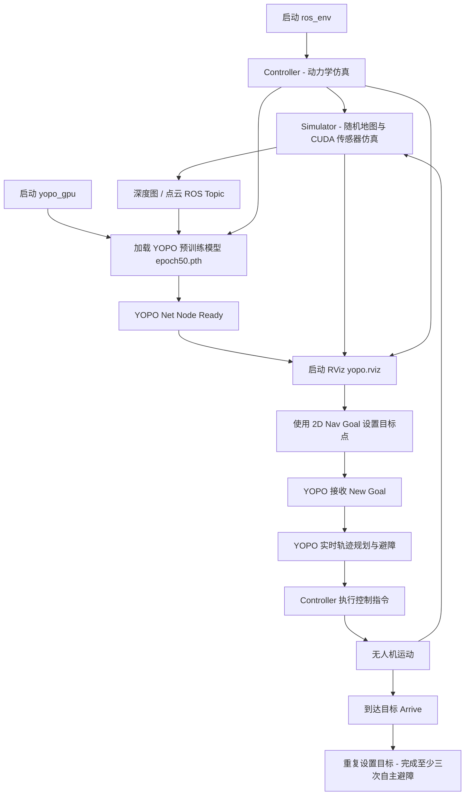

# YOPO 系统启动流程图

```mermaid
flowchart TD
    A[启动 ros_env] --> B[Controller - 动力学仿真]
    B --> C[Simulator - 随机地图与 CUDA 传感器仿真]
    C --> D[深度图 / 点云 ROS Topic]
    E[启动 yopo_gpu] --> F[加载 YOPO 预训练模型 epoch50.pth]
    D --> F
    B --> F
    F --> G[YOPO Net Node Ready]
    G --> H[启动 RViz yopo.rviz]
    C --> H
    B --> H
    H --> I[使用 2D Nav Goal 设置目标点]
    I --> J[YOPO 接收 New Goal]
    J --> K[YOPO 实时轨迹规划与避障]
    K --> L[Controller 执行控制指令]
    L --> M[无人机运动]
    M --> C
    M --> N[到达目标 Arrive]
    N --> O[重复设置目标 - 完成至少三次自主避障]
```
